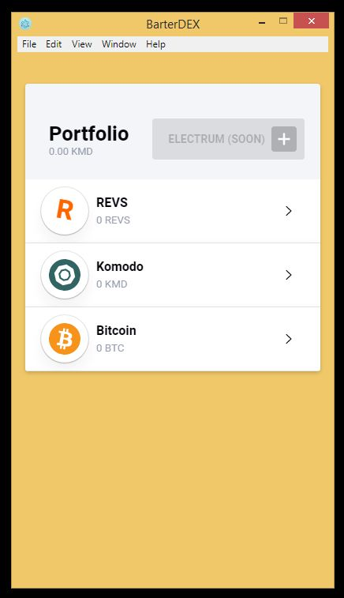

## How to use BarterDEX on Windows platform?

In this small guide we will learn how to user BarterDex GUI from [buildog](https://github.com/buildog/BarterDEX "buildog") on Windows 64-bit platform (32-bit platforms is not supported).

**Requirements:**

- Windows 7 64-bit and higher (Windows 8.1, Windows 10 also supported)
- [Node.js](https://nodejs.org/en/) for Windows installed
- [Git](https://git-scm.com/download/win) for Windows installed
- [Far Manager](https://www.farmanager.com/download.php) - console file manager for Windows for more convenient work with the command line and editing files.

**Installation manual:**

**1.** Download and Install Node.Js, Git and Far Manager from the links above. 
**2.** Run Far Manager as an Administrator and navigate to any drive's root (for example C:\ or D:\). You can use Alt-F1 to select drive in left panel or Alt-F2 to select drive in right panel.
**3.** Clone [my branch](https://github.com/DeckerSU/BarterDEX) of BarterDEX GUI by typing:

    git clone https://github.com/DeckerSU/BarterDEX
	git checkout dev-decker-win32

It has necessary changes for Windows platform.

**4.** Go into BarterDEX folder and execute sequentially the following commands:

    npm update
    npm install

**5.** Download latest marketmaker binary [release](https://github.com/DeckerSU/SuperNET/releases) from my repo. Curently latest version is [0.07alpha_win](https://github.com/DeckerSU/SuperNET/releases/tag/0.07alpha_win).

**6.** Extract the following files from archive:

- curl.exe
- libcurl.dll
- marketmaker.exe
- nanomsg.dll

To BarterDEX\node_modules\marketmaker\bin\win32\x64. For example, if you have cloned BarterDEX GUI in root of drive C:\ full path where you need to place binaries will be C:\BarterDEX\node_modules\marketmaker\bin\win32\x64 :

 

**7.** Make marketmaker folder in %APPDATA%:

    mkdir %APPDATA%\marketmaker

And copy coinslist.json from BarterDEX as coins.json in %APPDATA%\marketmaker . As a result your %APPDATA%\marketmaker folder should contain coins.json file with full list of coins:

Hint: to change current folder in panel to %APPDATA%\marketmaker you can simply type in command line:

    cd %APPDATA%\marketmaker

**8.** Start all needed coin daemons, for example, komodod.exe for KMD, bitcoind.exe for Bitcoin and others if needed. Make sure you have correct daemons config files to make daemon work as RPC server. For example, komodo.conf:

    server=1
    rpcuser=barterbtc
    rpcpassword=barterkomodo
    rpcallowip=127.0.0.1

This lines needed to make komodod listening on default RPC port. This is necessarily for marketmaker could contact them.

**9.** Navigate into BarterDex folder and type:

    npm start

If you have done all the steps before correctly you should see BarterDex login window with passphrase prompt:

Enter your **secret passphrase** here and press Login button. Pay attention to choose strong passphrase, because all coin smartaddresses will be generated from your input. Using simple passphrases like 12345, qwerty is unacceptable, because anyone who entered same passphrase potentially can get access to your smartaddresses and your coins deposits.

**10.** Now BarterDEX GUI is ready for work:

